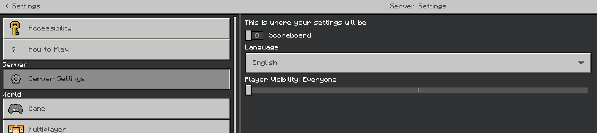

# ServerSettingsAPI

Simple API for creating a custom settings menu for MCPE clients (PocketMine only)

## Including in other plugins

### As a virion
This library supports being included as a [virion](https://github.com/poggit/support/blob/master/virion.md).

If you use [Poggit](https://poggit.pmmp.io) to build your plugin, you can add it to your `.poggit.yml` like so:

```yml
projects:
  YourPlugin:
    libs:
      - src: WolfDen133\ServerSettings\libServerSettings
        version: ^1.0.0
```

## Usage

Import the classes 

```php
use WolfDen133\ServerSettings\API;
use WolfDen133\ServerSettings\ServerSettings;
```

Then register the API to your plugin (required).
If you don't do this, the plugin will not be able to function correctly.
```php
API::register($this); // $this being your plugin instance
```

Then define your server settings (see [wiki](https://github.com/Wolfden133/ServerSettingsAPI/wiki) for full usage)
```php
API::getServerSettings()->setTitle($title);                         
API::getServerSettings()->addLabel($text);
API::getServerSettings()->addInput($title);
API::getServerSettings()->addToggle($text);
API::getServerSettings()->addSlider($text, $min, $max);
API::getServerSettings()->addStepSlider($text, $steps);
API::getServerSettings()->addDropdown($text, $options);
```

Then you can define an icon (optional) (see [wiki](https://github.com/Wolfden133/ServerSettingsAPI/wiki) for full usage)
```php
API::getServerSettings()->setIcon($iconType, $data);
```

Finally listening for the data 
```php
API::getServerSettings()->setCallable(function (Player $player, array $data = null) : void {
    if ($data == null) return;
    
    // Your methods here
    // Data is presented as an array with the order of which you set it as, much like a custom form from jojoe77777/FormAPI
});
```

And that's it, easy right!

## Per player menu
Coming soon

## Example

```php
protected function onEnable () : void
{
        API::register($this);

        API::getServerSettings()->setTitle("Server Settings");
        API::getServerSettings()->setIcon(ServerSettings::TYPE_PATH, "textures/ui/settings_glyph_color_2x");
        API::getServerSettings()->addLabel("This is where your settings will be");
        API::getServerSettings()->addToggle("Scoreboard");
        API::getServerSettings()->addDropdown("Language", ["English", "French", "German", "Spanish"]);
        API::getServerSettings()->addStepSlider("Player Visibility", ["Everyone", "Friends & Party", "No one"]);

        API::getServerSettings()->setCallable(function (Player $player, array $data = null) : void {
            if ($data == null) return;
        });
}
```

